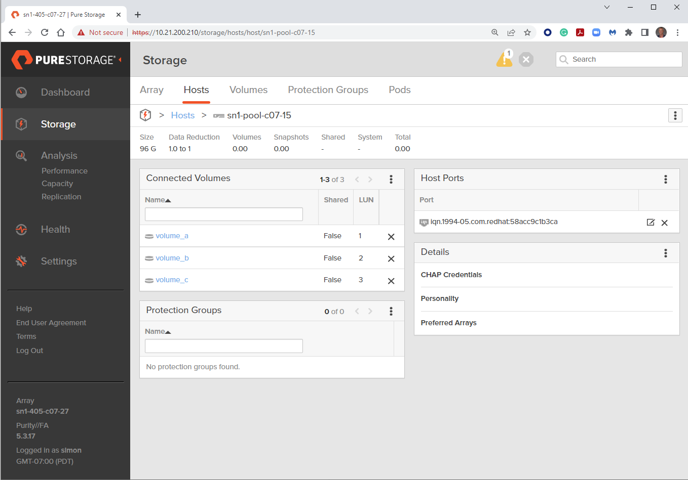

# Exercise 1.2 - Connecting volumes to a host on a FlashArray

## Table of Contents

- [Objective](#objective)
- [Guide](#guide)
- [Playbook Output](#playbook-outbook)
- [Solution](#solution)
- [Verifying the Solution](#verifying-the-solution)

# Objective

Demonstrate the use of the [purefa_host module](https://docs.ansible.com/ansible/latest/collections/purestorage/flasharray/purefa_host_module.html) to connect existing volumes to a host on a Pure Storage FlashArray.

# Guide

## Step 1:

Using the text editor, create a new file called `purefa-connect.yaml`.

## Step 2:

Enter the following play definition into `purefa-connect.yml`:

``` yaml
---
- name: CONNECT SETUP
  hosts: localhost
  connection: local
  gather_facts: true
  vars:
    url: 10.34.56.233
    api: 89a9356f-c203-d263-8a89-c229486a13ba
```

- The `---` at the top of the file indicates that this is a YAML file.
- The `hosts: localhost`, indicates the play is run on the current host.
- `connection: local` tells the Playbook to run locally (rather than SSHing to itself)
- `gather_facts: true` enables facts gathering.  
- The `vars:` parameter is a group of parameters to be used in the playbook.
- `url: 10.34.56.233` is the management IP address of your FlashArray - change this reflect your local environment.
- `api: 89a9356f-c203-d263-8a89-c229486a13ba` is the API token for a user on the FlashArra - change this reflect your local environment.

## Step 3:

Next, add the first `task` to the playbook. This task will use the `purefa_host` module to attach the three volumes created in [Exercise 1.2](../1.2-add-volumes) to the host created in [Exercise 1.1](../1.1-add-host) on the Pure Storage FlashArray.

``` yaml
  tasks:
    - name: ATTACH VOLUMES
      purestorage.flasharray.purefa_host:
        name: "{{ ansible_hostname }}"
        volume: volume_{{ item }}
        fa_url: "{{ url }}"
        api_token: "{{ api }}"
      loop:
        - a
        - b
        - c
```

- `name: ATTACH VOLUMES` is a user defined description that will display in the terminal output.
- `purefa_host:` tells the task which module to use.
- The `name` parameter tells the module to use the `ansible_hostname` variable obtained from the host fact gathering.
- The `volume` parameter tells the module the name of the volume to connect to the host object. The `{{ item }}` varable instructs Ansible with the loop value.
- The `fa_url: "{{url}}"` parameter tells the module to connect to the FlashArray Management IP address, which is stored as a variable `url` defined in the `vars` section of the playbook.
- The `api_token: "{{api}}"` parameter tells the module to connect to the FlashArray using this API token, which is stored as a variable `api` defined in the `vars` section of the playbook.
- `loop:` tells the task to loop over the provided list.  The list in this case is the suffix to be appended to the volume name.

Save the file and exit out of the editor.

## Step 4:

Run the playbook - Execute the following:

```
[student1@ansible ~]$ ansible-playbook purefa-connect.yml
```

# Playbook Output

The output will look as follows.

```yaml
[student1@ansible ~]$ ansible-playbook purefa-volume.yml

PLAY [CONNECT SETUP] ****************************************************************************************************

TASK [Gathering Facts] **************************************************************************************************
ok: [localhost]

TASK [CONNECT VOLUMES] **************************************************************************************************
changed: [localhost] => (item=a)
changed: [localhost] => (item=b)
changed: [localhost] => (item=c)

PLAY RECAP **************************************************************************************************************
localhost                  : ok=2    changed=1    unreachable=0    failed=0    skipped=0    rescued=0    ignored=0
```

# Solution

The finished Ansible Playbook is provided here: [purefa-connect.yml](https://github.com/PureStorage-OpenConnect/ansible-workshop/blob/main/1.3-connect-volumes/purefa-connect.yaml).

# Verifying the Solution

Login to the Pure Storage FlashArray with your web browser using the management IP address you set in your YAML file.

Navigating using the menu on the left to Storage, then select Hosts top menu, finally select the host object you have created in the Hosts sub-window. This will show the volumes that are connected to the host and the LUN IDs assigned to each volume.
